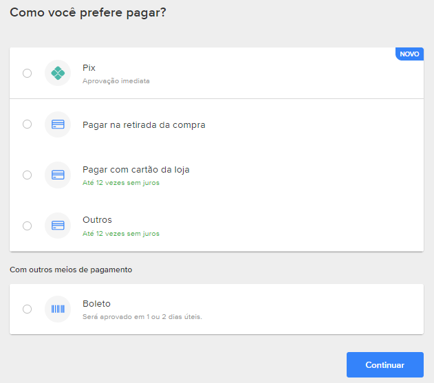
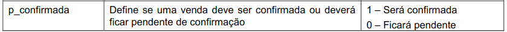
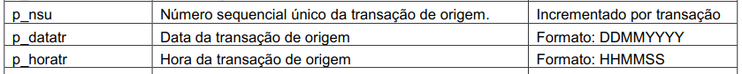
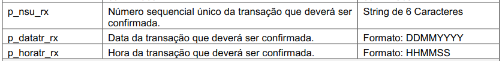

# Integração E-Commerce

A integração e-commerce pode ser feitas de duas formas : 

- Via POS
- Via SOAP 

Estes dois modos de integração serão tratados neste artigo. Cada um deles de modo detalhado a fim de facilitar o entendimento dos gerentes a respeito dos meios de inegração e auxiliar os programadores na compreensão da parte técnica.

<h2>Via POS </h2>

Este método é apenas uma alternativa e requer menos esforço de implementação. O mesmo consiste, basicamente, no pagamento da compra na hora da retirada dos produtos(modalidade pós pago).
É preciso parametrizar esta opção no módulo de administrador do sistema como sendo uma das formas de pagamento que serão exibidas no front-end para os clientes no momento do checkout. 

- O cliente faz a escolha dos produtos no site.
- Seleciona a opção de pagar utilizando o cartão da empresa.
- Na hora de retirar o produto o cliente efetua o pagamento na máquina POS física ou no POS virtual.

  

Ao invés de ser debitada a compra no cartão na hora da compra via e-commerce, ela é debitada na máquina na retirada do produto.

<h2>Via SOAP<a href="documentoBiz.pdf"> (Documento) </a></h2> 

O SOAP é o protocolo utilizado pela BIZ para que sejam efetuadas as transações que são feitas com os cartões da UZE.
 

### Exemplo de fluxo do processo : 

- Cliente seleciona os produtos que deseja.

<table align="center">
  <tbody>
    <tr><th>Sabão em pó X - R$15,00</th></tr>
    <tr><th>Amaciante Y - R$15,00</th></tr>
    <tr><th>1kg de Inhame - R$ 8,00 Kg</th></tr>
    <tr><th></th></tr>
    <tr><th>Total = R$38,00</th></tr>
  </tbody>
</table>

- No momento da separação dos produtos e pesagem, o produto a peso, ficou em 980g ao invés de 1Kg conforme solicitado. Neste caso, a compra original deve ser CANCELADA e uma nova compra DEVE SER COMPUTADA.

### Na prática : 
- A compra deverá ser lançada utilizando o serviço "Compra", porém com o campo "p_confirmada" igual a 0, ou seja, ficará pendente confirmação para o caso de o valor não coincidir.

  

- Será necessário guardar o número p_nsu (Número sequencial único) da transação de origem e todas as demais informações do passo <b>#5 - Compra e Pagamento</b> do documento SOAP. Essas informações serão necessárias para os passos <b>#6 - Confirmação de compra e pagamento</b> e <b>#7 - Cancelamento de compra e pagamento</b>

  Compra e Pagamento
  

  Confirma Compra e Pagamento
  

Nesta segunda imagem mostra que é necessário enviar os 3 dados da operação operação anterior para confirmá-la.
O mesmo acontece para o cancelamento.

- Para o cancelamento, siga o passo <b>#7</b> do documento SOAP.

- Para o cadastramento da nova compra, siga os passos <b>#5</b> e <b>#6</b> do documento SOAP.

# Vídeo explicativo

https://user-images.githubusercontent.com/86687737/123870897-5f325800-d909-11eb-8249-56df5990814f.mp4

- Link da documentação : [Documentacao Biz](documentacaoBiz.pdf)
 
 

# Dúvidas

Para o caso de dúvidas entre em contato conosco através do link abaixo : 
- < LINK DO PIPEFY > 
